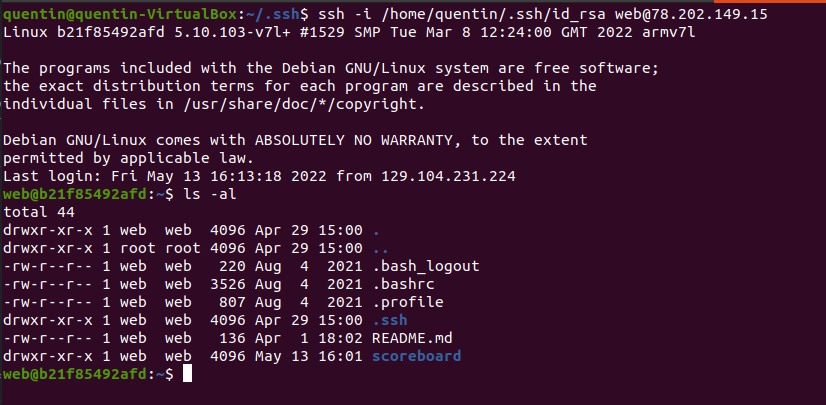
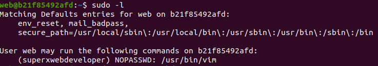
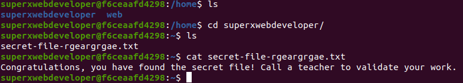

# BETA CHALLENGE (INF473X The Hacking Xperience)

## Run commands

Download the Python required libraries by running the command `pip3 install -r requirements.txt`.

Run `python3 win_the_game.py YOUR NAME` to guess the 5 numbers, win the loto and put _YOUR NAME_ on the wall of fame.

Run `python3 ssh_injection.py` to inject your public key in the web machine.

## 1st part : guess the 5 numbers

Once the username and the password have been found, the first challenge is to guess the 5 numbers to win the loto. However, these numbers are randomly generated through the function `challenge` in the `main.py` file :
```
def challenge(id):
    random.seed(int(time.time()) + id)
    solution = random.sample(list(range(1,50)), 5)
    solution.sort()
    return solution
```
Well, isn't there a way to be able to calculate these numbers? Indeed, `challenge` calls the function `random.seed` which fixes the start number of the random number generator. Having for example `random.seed(2) // random.random()` in two different places in a program would give the same number. Thus, knowing the start number that generates these 5 random numbers, we can easily guess them by writing a Python script and fix our start number as well. However, `random.seed` here depends on `time.time()`, we got to be quick and precise when fixing our start number. This is why we will be using a Python script to send and get requests from the website.

The Python Script uses the library _"requests"_ to interact with the website. We use _"flask-unsign"_ which is a library that deals with web cookies. Cookies are important here because they contains one's ID in the session data and the player's ID appears in the calculation of the start number when `random.seed` is called. Here is what `win_the_game.py` prints out when running `python3 win_the_game.py BETA BEST CHALLENGER` :


As we can see, our name has been successfully added to the scoreboard page :


## 2nd part : SSH penetration

Let's look at the function `scoreboard`:
```
def scoreboard():
    if request.method == "POST":
        if 'state' not in session or session["state"] != "winner":
            return redirect("/login", 302)
        with open(scoreboard_folder + request.form["date"], "a+") as f:
            f.write(request.form["name"])
```
A big vulnerability is the the file writing. As we are able to customize the dictionnary `request.form` (like in part 1), the above function allows us to potentially write whatever file we want with `request.form["date"]` as name and `request.form["name"]` as contents. Let's exploit it and try to settle down in the host machine through SSH Key-Based Authentication.

SSH is a protocol used to run shell commands on a remote machine provided it has a key (our SSH public key) recognizable by ours (our SSH private key). The previous vulnerability allows us to install this SSH public key on the host machine so we can run a remote shell on it.

First things first, the command `ssh-keygen -t rsa -b 4096` generates a private and a public key on our computer :
```
Your identification has been saved in /home/quentin/.ssh/id_rsa
Your public key has been saved in /home/quentin/.ssh/id_rsa.pub
```
Then, I copied my public key in the Python Script `ssh_injection.py`. The latter writes my public key in the authorized keys file of the host machine. Here is how the `request.form` dictionnary looks like : `{ "name" : PUBLIC_KEY, "date" : "../.ssh/authorized_keys" }`. Once done, the command `ssh -i /home/quentin/.ssh/id_rsa web@78.202.149.15` simply run a shell of the remote machine.


Now, we can proceed to a [sudo privilege escalation](https://www.youtube.com/watch?v=4nCnh6BHcUg&ab_channel=Conda). By typing `sudo -l`, we can read that as _superxwebdeveloper_, we have access to the command `/usr/bin/vim` with no password :


Let's exploit this vulnerability and run `sudo -u superxwebdeveloper vim`. Vim is a text editor on which we can write commands for exemple `:!/bin/bash` to run a bash shell. As Vim has just been run with sudo as _superxwebdeveloper_, the bash shell will be running as a super admin. By searching in the computer files, we can find the challenge's answer !

