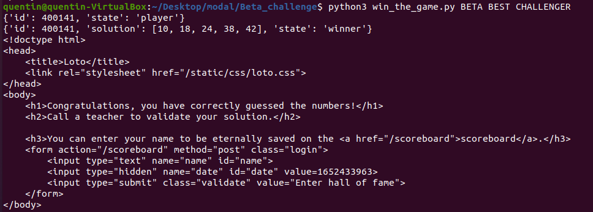
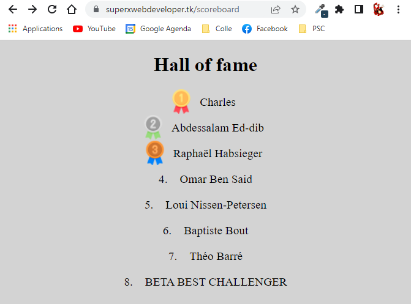

# BETA CHALLENGE (INF473X The Hacking Xperience)

## Run commands

Download the python the required libraries by running the command `pip3 install -r requirements.txt`. (TO DO)
Run `python3 win_the_game.py YOUR NAME` to guess the 5 numbers, win the loto and put _YOUR NAME_ on the wall of fame.

## 1st part : guess the 5 numbers

Once the username and the password have been found, the first challenge is to guess the 5 numbers to win the loto. However, these numbers are randomly generated through the function `challenge` in the `main.py` file :
```
def challenge(id):
    random.seed(int(time.time()) + id)
    solution = random.sample(list(range(1,50)), 5)
    solution.sort()
    return solution
```
Well, isn't there a way to be able to calculate these numbers? Indeed, `challenge` calls the function `random.seed` which fixes the start number of the random number generator. Having for example `random.seed(2) // random.random()` in two different places in a program would give the same number. Thus, knowing the start number that generates these 5 random numbers, we can easily guess them by writing a Python script and fix our start number as well. However, `random.seed` here depends on `time.time()`, we got to be quick and precise when fixing our start number. This is why we will be using a Python script to send and get requests from the website.

The Python Script uses the library _"requests"_ to interact with the website. We use _"flask-unsign"_ which is a library that deals with web cookies. Cookies are important here because they contains one's ID in the session data and the player's ID appears in the calculation of the start number when `random.seed` is called. Here is what `win_the_game.py` prints out when running `python3 win_the_game.py BETA BEST CHALLENGER` :


As we can see, our name has been successfully added to the scoreboard page :

