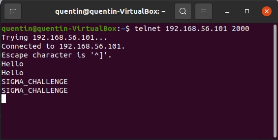

# SIGMA CHALLENGE (INF473X The Hacking Xperience)

## Run commands

In root login, run `./syn_flooding IP_ADDRESS PORT` where `IP_ADDRESS` and `PORT` are the ip address and the port you want to flood.

To use the multithreading version, run `./syn_flooding_multi IP_ADDRESS PORT NB_THREAD` with an additional argument `NB_THREAD` which is simply the number of threads.

## Introduction

The goal of this challenge is to implement a type of Denial of Service attack (DDoS) by spamming hard a server with TCP Syn packets.

Basically, when a client looks for establishing a TCP link with a server, it has to start a _"Three-way handshake"_ :
- Client -----__SYN__---> Server : the client informs the server that it would like to start a communication
- Client <--__SYN-ACK__-- Server : the server tells back to the client that it is available
- Client -----__ACK__---> Server : the client acknowledges and all data transfers can start
When the server receives a SYN packet, it has to allocate a certain amount of memory (buffers) to temporarily store the received data and once the SYN-ACK packet has been sent, the server has to wait for client's ACK packet. Thus, the TCP Syn attack consists to send a lot of SYN packet to a server to make too busy to handle legitimate SYN packets from real clients. The task for this challenge is to be able to generate TCP RAW packets (a little bit like we did for UDP datagrams in tutorial 4) with IP spoofing so that the server believes the received packets are coming from different clients. The following picture shows the SYN packets sent by my program :

## VM Tests

I tested my program on the 2 hacked VMs proposed at the bottom of the challenge page. These VMs are echo servers and should basically return back what one sends to them :

Let's flood the first VM by running the command `./syn_flooding 192.168.56.101 2000`. As we can see, the server doesn't repond anymore :

In addition, new clients fail when they try to contact the server for the first time :

## Packet rate improvement with multithreading

In order to increase the packet rate, I made a multithreading version. The packet rate is about 25 200 per minute for the first version (`./syn_flooding 192.168.56.101 2000`) whereas it is up to 1 645 116 per minute for the multithreading version (`./syn_flooding_multi 192.168.56.101 2000` for 10 threads).
